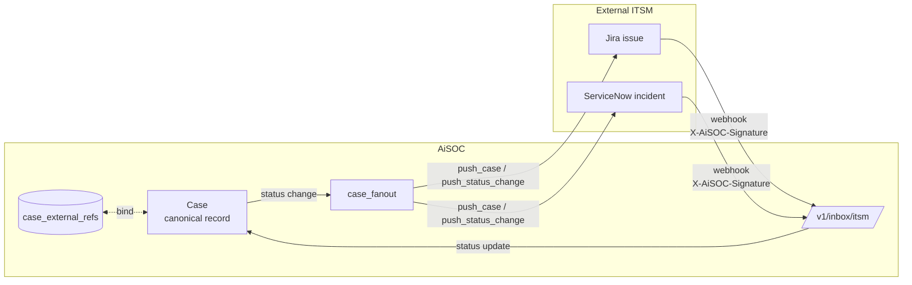

# ITSM as a projection of AiSOC

A common ask from security teams adopting AiSOC is "can the case also live in our ITSM?" The honest answer is: yes, but the ITSM ticket is a **projection** of the AiSOC case, not a peer of it. AiSOC is the source of truth for the security investigation; Jira and ServiceNow are downstream representations that human responders, change-management processes, and executive dashboards consume.

This page explains how the bidirectional bridge is built, what state lives where, and how conflicts are resolved.

## Why AiSOC is the source of truth

A security case is more than a row in a ticketing system. It carries:

- **Detection lineage** — which detection rule(s) fired, what raw events were involved, what the OCSF-normalized representation of those events looks like.
- **Agent reasoning** — the chain of investigative steps the multi-step agent took, including which tools it called, what each tool returned, and the confidence the agent expressed at each step.
- **Evidence graph** — entities (hosts, users, IPs, domains, hashes, vulnerabilities) connected by the relationships the agent or analyst discovered. This graph is queryable and is what makes "show me everything we know about this user during the past hour" possible.
- **Containment intent + outcome** — the actual API calls AiSOC issued to EDRs, identity providers, and firewalls, and the responses it got back.
- **Audit trail** — append-only record of every state transition, who/what caused it, and when.

ITSM systems are excellent at the **last** layer of that — assignment, SLA tracking, executive visibility, change-management approval. They are not built to hold the first four. So the architecture question becomes: how do we let the ITSM workflow drive the parts it owns (assignment, status, due dates) without letting it lose or overwrite the parts AiSOC owns (evidence, reasoning, containment outcome)?

The answer is the projection model: AiSOC owns the canonical record; the ITSM ticket is a thin reflection that the bridge keeps in sync, with explicit, narrow rules for what flows in each direction.

## State boundaries — what lives where

| Concern | Owned by AiSOC | Owned by ITSM | Synced |
|---|---|---|---|
| Detection rule + raw events | ✅ | — | ITSM gets a summary + a deep link back into AiSOC. |
| Evidence graph (hosts/users/IPs/files) | ✅ | — | ITSM gets a flat "involved entities" list. |
| Agent reasoning chain | ✅ | — | ITSM gets the agent's final summary as a comment. |
| Containment actions issued | ✅ | — | ITSM gets a comment per action with timestamp + outcome. |
| Severity (initial) | ✅ | — | One-way push at create time. |
| **Status / lifecycle state** | ✅ (canonical) | ✅ (operational) | Bidirectional — AiSOC reflects ITSM transitions back into the canonical record. |
| Assignee | — | ✅ | One-way pull. AiSOC stores it as metadata for filtering. |
| Comments authored by humans in ITSM | — | ✅ | Pulled into AiSOC as annotations on the case timeline. |
| Due date / SLA timer | — | ✅ | AiSOC does not enforce; ITSM owns the clock. |

The principle is: **anything that informs detection, response, or audit lives in AiSOC. Anything about who is doing the work and how the org tracks it lives in ITSM.** Nothing critical to investigation is _only_ in the ITSM ticket.

## The pieces

The bridge is implemented across three layers:

1. **Outbound from connectors** — `push_case` and `push_status_change` methods on the [`Jira`](https://github.com/AiSOC-community/AiSOC/blob/main/services/connectors/app/connectors/jira_connector.py) and [`ServiceNow`](https://github.com/AiSOC-community/AiSOC/blob/main/services/connectors/app/connectors/servicenow.py) connectors. These are the verbs AiSOC uses to mint a ticket and to project a status transition onto an existing one. They are declared on the connector via the [`PUSH_CASE` / `PUSH_STATUS`](/docs/connectors/api-coverage) capabilities.
2. **Case fan-out service** — `services/api/app/services/case_fanout.py`. When a case is created or its status changes inside AiSOC, this service iterates every connector instance for the tenant that declares `PUSH_CASE` / `PUSH_STATUS` and calls them. Successful pushes are recorded in `case_external_refs`; failures are recorded with the error and retried on the next state change.
3. **Inbound webhook** — `POST /v1/inbox/itsm`, implemented in `services/api/app/api/v1/endpoints/inbox_itsm.py`. ITSM systems call this with a signed payload when a ticket they are tracking transitions; the webhook verifies the HMAC, looks up the corresponding AiSOC case via `case_external_refs`, and applies the (filtered) status change idempotently to the canonical case.

## The `case_external_refs` table

The bridge needs a stable mapping between AiSOC cases and external tickets. That is what `case_external_refs` (migration `035_case_external_refs.sql`) holds:

| Column | Meaning |
|---|---|
| `tenant_id` | Owner of both the case and the connector instance. Always scoped. |
| `case_id` | AiSOC case (FK). |
| `connector_id` | Which connector instance is pushing — multiple ITSMs can mirror the same case. |
| `vendor` | `jira` / `servicenow` / future ITSMs. Indexed because the inbound webhook routes on it. |
| `external_id` | Stable vendor identifier — Jira issue key (`AISOC-1234`), ServiceNow `sys_id`. |
| `external_url` | Direct link the UI surfaces on the case sidebar. |
| `last_pushed_status` | Last status AiSOC projected to the vendor. Used to suppress redundant pushes. |
| `last_inbound_status` | Last status the vendor told us. Used to suppress projection loops (we will not push back a status we just received). |
| `created_at` / `updated_at` | Standard. |

The `(connector_id, vendor, external_id)` triple is unique, which is what makes the inbound webhook idempotent: a duplicate webhook delivery (vendors retry aggressively) resolves to the same row and does the same no-op.

## Outbound: case create

When `POST /v1/cases` mints a new case, the create endpoint hands the row to `case_fanout.fanout_create_case`. That function:

1. Loads every active connector instance for the tenant where `PUSH_CASE` is in `connector.capabilities()`.
2. Decrypts the connector's `auth_config` via the [credential vault](/docs/operations/credentials) and instantiates the typed connector.
3. Calls `push_case(case)` and gets back a `PushResult` with the vendor's external ID and URL.
4. Inserts a `case_external_refs` row recording the binding.
5. Logs the push outcome on the case timeline so the analyst sees "minted JIRA-1247" without leaving the case view.

If a single connector fails, fan-out continues for the rest. The case itself is never blocked on a downstream ITSM call — the ITSM is a projection, not a gate. Failed pushes are visible on the connector card and are re-attempted on the next status transition or via a manual "resync" action.

## Outbound: status change

When a case status moves inside AiSOC (`open → triage → contained → resolved → closed`), `case_fanout.fanout_status_change` runs:

1. Loads every `case_external_refs` row for the case.
2. For each row, instantiates the connector and calls `push_status_change(external_id, new_status)`.
3. The connector translates the AiSOC status into its vendor's vocabulary — Jira via the **Transitions API** (resolving the right transition ID for the target status), ServiceNow via a `PATCH` on the incident table with the appropriate `state` and `incident_state` values.
4. Updates `last_pushed_status` on the ref row.

Two safety properties are enforced here:

- **No-op suppression.** If `last_pushed_status` already equals the target, fan-out skips the call. This avoids generating noise in the ITSM activity feed when a status is set to its current value (which happens during reconciliation).
- **Loop suppression.** If `last_inbound_status` was just set to the same target by a webhook seconds ago, fan-out also skips. This prevents the classic ping-pong (we push to Jira → Jira webhooks back to us → we push back to Jira) that plagues naïve bridges.

## Inbound: webhook from ITSM

`POST /v1/inbox/itsm` is the public-facing surface that Jira and ServiceNow webhooks call when a ticket they hold transitions. The handler:

1. **Authenticates the request** via `X-AiSOC-Signature`, an HMAC over the raw body keyed by the per-tenant inbox token. The token is provisioned through the regular [inbox token flow](/docs/api/rest) using the `itsm-inbound` template.
2. **Identifies the vendor** from the payload shape (Jira sends `issue.fields`, ServiceNow sends `sys_id` + `state`) and pulls the canonical external ID and the vendor-native status.
3. **Maps the vendor status** through `_JIRA_INBOUND_STATUS` / `_SNOW_INBOUND_STATUS` to AiSOC's status ladder. Statuses outside the mapped set (e.g. exotic Jira workflows) are accepted but the case is not transitioned — the webhook returns `200 OK` with `{"applied": false, "reason": "unmapped_status"}` so the vendor stops retrying.
4. **Resolves the case** by joining `case_external_refs` on `(vendor, external_id)`, scoped by the tenant the inbox token was minted for.
5. **Applies the status idempotently.** If the case is already in the target status (perhaps because we pushed it ourselves a second ago), the handler is a no-op. Otherwise, it transitions the case and writes three timeline rows: the status change itself, the `actor_label` ("itsm-webhook (jira)"), and the inbound payload reference for audit.
6. **Updates `last_inbound_status`** so the next outbound fan-out round can suppress the loop.

The handler commits exactly once. Any failure during the transition rolls the whole thing back — the ITSM webhook will retry, and since the binding is still in place, the second attempt will succeed cleanly.

## Conflict resolution

The bridge can hit four kinds of conflicts. Here is how each is resolved:

1. **AiSOC status moves while ITSM is mid-transition.**
   AiSOC wins. The fan-out runs, `push_status_change` overwrites the ITSM state, `last_pushed_status` is updated. The vendor's webhook for the in-flight transition arrives a moment later; because it matches `last_pushed_status` (it's the status we just set), it is a no-op.
2. **ITSM status moves while AiSOC is processing a containment action.**
   ITSM wins for the **status field only** — that is its responsibility. The containment outcome continues to be appended to the AiSOC case timeline. The case status reflects the ITSM state; the evidence record reflects everything else.
3. **Same status arrives from both sides at the same time.**
   The idempotency check resolves it — whichever transaction commits first wins; the second sees the case already at the target and exits cleanly.
4. **Vendor returns a transition error** (e.g. Jira will not allow `Resolved → To Do` directly).
   `push_status_change` records the failure on the ref row and surfaces it on the connector card. The case in AiSOC still transitions; the ITSM ticket stays where it was. A human can either fix the Jira workflow or trigger a manual "force-sync" that bypasses the transition graph by using the admin API.

## What is _not_ synced

To keep this contract small enough to reason about, we deliberately do **not** mirror:

- **Free-text comments** authored inside AiSOC. The agent writes a lot of analysis. It would be noise in the ITSM activity feed. The ITSM ticket carries one structured summary block plus the deep link.
- **Severity changes after creation.** The initial severity is pushed; subsequent changes inside AiSOC do not touch the ITSM. This is deliberate — security severity reflects detection confidence, ticketing severity reflects business priority, and they are not the same axis.
- **Detection rule edits, suppression rules, agent prompt changes.** All of these live in AiSOC and have no ITSM analog.
- **The evidence graph itself.** AiSOC exposes it through the case API and the UI; the ITSM ticket links to it.

If a team wants any of these mirrored, the right answer is usually a small detection-content workflow or a dashboard, not extending the projection contract.

## Operational notes

- **Webhook secrets are per-tenant.** Provision them through the existing inbox-token flow with template `itsm-inbound`. The same token is used for both Jira and ServiceNow webhooks — the handler tells them apart from the body, not from the URL.
- **Backfill.** When you turn on the bridge against a tenant that already has open cases, the first fan-out pass mints tickets for them. This can be a lot of work; gate it with a feature flag and ramp by case count if your ITSM has rate limits. Both Jira Cloud and ServiceNow have surprisingly tight per-minute API caps.
- **Observability.** Every push and every webhook lands as a row on the case timeline with the `itsm-webhook (vendor)` actor label. Filter by that label to see the cross-system traffic for any case in one view.
- **Disabling the bridge.** Removing a connector instance does **not** delete its `case_external_refs` rows. Old links remain, but no further pushes happen. Re-enabling the connector picks up exactly where it left off, idempotently.

## Where this lives in the code

| Concern | File |
|---|---|
| Outbound contract | `services/connectors/app/connectors/base.py` (`push_case`, `push_status_change`, `Capability.PUSH_CASE`, `Capability.PUSH_STATUS`) |
| Jira impl | `services/connectors/app/connectors/jira_connector.py` |
| ServiceNow impl | `services/connectors/app/connectors/servicenow.py` |
| Outbound HTTP routes | `services/connectors/app/api/router.py` |
| Fan-out orchestrator | `services/api/app/services/case_fanout.py` |
| Case lifecycle hooks | `services/api/app/api/v1/endpoints/cases.py` |
| Inbound webhook | `services/api/app/api/v1/endpoints/inbox_itsm.py` |
| External-ref table | `services/api/migrations/035_case_external_refs.sql` |

For the per-connector capability picture (which ITSMs declare `PUSH_CASE` today, which do not yet), see the [capability matrix](/docs/connectors/api-coverage).
