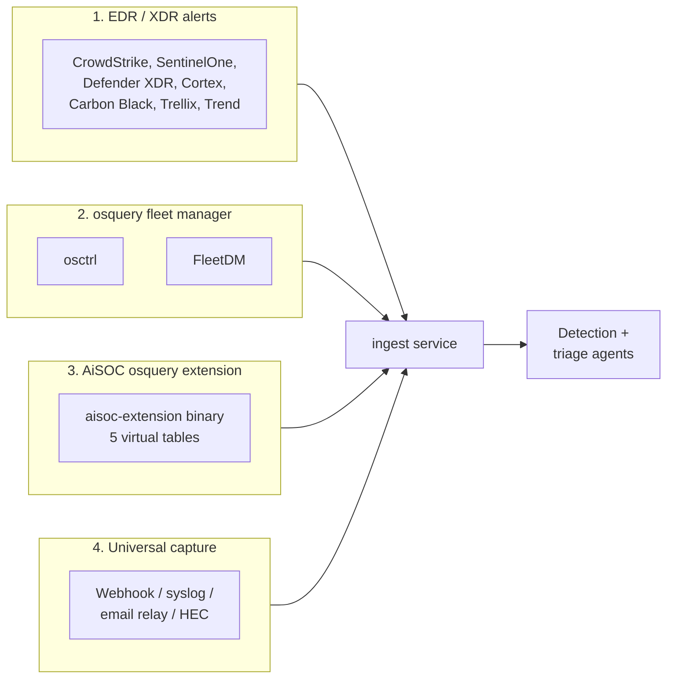

# Endpoint connector decision matrix

AiSOC ships with **four distinct paths** for getting endpoint telemetry into the
pipeline. They are not mutually exclusive — most production deployments use two
or three at once — but each has a different sweet spot. This page is a quick
decision aid for operators who are wiring up endpoint coverage for the first
time and aren't sure which connector to enable.

If you already know which class of source you want, skip to the per-connector
walkthrough linked from the [Connectors catalog](/docs/connectors).

## TL;DR — pick by what you already have

| If you already run… | Start with | Why |
|---|---|---|
| A commercial EDR / XDR (CrowdStrike, SentinelOne, Defender, Cortex, Carbon Black) | The matching **EDR connector** | You get vendor-curated alerts immediately; no agent to deploy |
| osquery + a fleet manager (osctrl, FleetDM) | **[osctrl](/docs/connectors/osctrl)** or **[FleetDM](/docs/connectors/fleetdm)** | Reuse your fleet for distributed-query results _and_ live-query response actions |
| Bare-metal Linux with `auditd`, no fleet manager | **Universal capture** (syslog/HEC) today; **aisoc-host-agent** when it ships | Lightweight path with no extra control plane |
| Nothing yet, want to start small | The **[AiSOC osquery extension](/docs/connectors/osquery-extensions)** layered on osquery | Surfaces AiSOC alerts and persistence baselines _inside_ the osquery shell |

## The four paths in detail

### 1. Commercial EDR / XDR connectors

These are the highest signal-to-noise sources because the vendor has already
correlated raw telemetry into alerts. AiSOC pulls the alert stream, normalises
severity into the four-tier ladder (`info`/`low`/`medium`/`high`), and feeds it
straight into detection routing.

**Available today:** [CrowdStrike Falcon](https://github.com/beenuar/AiSOC/blob/main/services/connectors/app/connectors/crowdstrike.py),
SentinelOne, [Microsoft Defender XDR](/docs/connectors/azure-defender),
Palo Alto Cortex XDR, Cortex XSIAM, VMware Carbon Black, Trellix Helix,
Trend Vision One.

**Pick this when** you already pay for an EDR and the security team treats it
as the source of truth for "is this host compromised".

**Trade-offs:**

- ✅ Zero new agents to deploy.
- ✅ Vendor-curated severity, MITRE mapping, and process-tree context.
- ❌ You don't see the raw events the vendor decided weren't alerts.
- ❌ Live-query response actions are vendor-specific (most playbook actions
  today target the osquery backends, not EDR APIs).

### 2. osquery fleet managers — osctrl and FleetDM

Both [osctrl](/docs/connectors/osctrl) and [FleetDM](/docs/connectors/fleetdm)
expose distributed-query results from a fleet of osquery agents. AiSOC polls
the manager's REST API, turns each result row into a normalised endpoint event,
and synthesises severity from the originating osquery table (persistence /
execution tables → `high`, FIM tables → `medium`, inventory → `info`).

The same connectors back the `osquery_live_query` playbook step, which lets a
playbook run on-demand allowlisted queries against affected hosts and feed the
rows back into the case as triage evidence.

**Pick this when** you want raw endpoint telemetry _and_ live response actions
from the same control plane, without paying for an EDR. This is the path most
self-hosted AiSOC deployments take.

**FleetDM vs osctrl** — see the [matching matrix in the FleetDM page](/docs/connectors/fleetdm#when-to-choose-fleetdm-vs-osctrl).
Short version: pick FleetDM if your team already runs it; pick osctrl if you
want the smaller infra footprint (PostgreSQL only, no MySQL or Redis).

**Trade-offs:**

- ✅ Open-source, self-hosted, no per-endpoint licensing.
- ✅ Same connector powers ingestion _and_ live-query playbook actions.
- ❌ You have to operate the fleet manager (osctrl or Fleet) yourself.
- ❌ Raw rows are noisy by default — detection authoring matters more than
  with EDR alert ingestion.

### 3. AiSOC osquery extension

The [aisoc-extension binary](/docs/connectors/osquery-extensions) goes the
other direction: instead of pulling osquery results into AiSOC, it surfaces
**AiSOC operational data inside the osquery shell** as five virtual tables
(`aisoc_pending_actions`, `aisoc_alert_cache`, `aisoc_attck_persistence`,
`aisoc_kernel_modules_verified`, `aisoc_browser_extensions`).

This is not an ingestion connector — it does not move data into AiSOC. It is
the **complement** to paths 2 and 3: once your fleet is sending data in via
osctrl/FleetDM, the extension lets responders query AiSOC's view of the host
from the same osquery shell they already use for IR triage.

**Pick this when** you've already wired an osquery fleet and want responders
to be able to answer "what does AiSOC currently know about this host?" via SQL.

### 4. Universal capture (webhook / syslog / HEC / email relay)

If none of the above fit — for example, you have a Linux box with `auditd`
running and no fleet manager, or a custom in-house EDR — the
[Universal capture](/docs/connectors/universal-capture) connector accepts
webhook POSTs, CEF syslog, Splunk HEC payloads, and email. Anything that can
emit one of those formats can land events in the same OCSF stream every other
connector feeds.

**Pick this when** the source isn't in the catalog and won't be soon, or when
you're prototyping a new agent locally before committing to writing a proper
connector.

**Trade-offs:**

- ✅ Works for literally anything that can POST or send mail.
- ❌ You own the field mapping — there is no schema-driven wizard.
- ❌ Best treated as a stopgap; for permanent integrations, write a proper
  connector ([Hello, connector tutorial](/docs/connectors/hello-connector)).

## Side-by-side comparison

| Dimension | EDR / XDR | osctrl / FleetDM | osquery extension | Universal capture |
|---|---|---|---|---|
| **What flows in** | Vendor alerts | osquery rows + (FleetDM) host posture | _Nothing_ — surfaces AiSOC data in the shell | Whatever you POST |
| **Severity source** | Vendor → 4-tier ladder | Synthesised from osquery table | n/a | You control it |
| **Live-query response** | Vendor-specific (limited today) | ✅ via `osquery_live_query` playbook step | n/a (read-only on host) | n/a |
| **Self-hosted-friendly** | Depends on vendor | ✅ Fully | ✅ Fully | ✅ Fully |
| **Per-endpoint cost** | EDR licence | Free (osquery + fleet manager) | Free | Free |
| **Setup complexity** | Low — paste API token | Medium — operate the fleet manager | Medium — deploy binary + systemd unit | High — design your own field mapping |
| **MITRE coverage** | Vendor-curated | Detection-rule-driven (you author) | n/a | Detection-rule-driven (you author) |
| **Platform support** | Vendor-defined | Linux / macOS / Windows (osquery) | Linux / macOS / Windows (osquery) | Anything |

## Common combinations

Most production AiSOC deployments end up running **at least two** of these in
parallel:

- **EDR + osquery fleet** — EDR for the curated alert stream, osquery fleet
  for the raw telemetry your detection rules need to spot what the EDR misses
  (custom persistence, lateral movement via SaaS tokens, etc.).
- **osquery fleet + osquery extension** — operators get both the
  detection-rule firehose and the in-shell AiSOC view for IR triage.
- **EDR + universal capture** — EDR is the primary source; universal capture
  catches the long tail (legacy Windows servers, IoT/OT gateways, custom
  internal tools).

There is no penalty for enabling multiple sources for the same host — events
land in the same OCSF stream and the dedupe key on detection rules handles
collapsing duplicate alerts.

## Roadmap signals

The endpoint connector surface is one of the most actively expanded areas of
AiSOC. Two work items are in the public roadmap and will land here when they
ship:

- **`aisoc-host-agent` daemon** — a lightweight Go daemon (mirroring the
  existing osquery deployment pattern) for hosts where running osquery + a
  fleet manager is overkill. Will give bare-metal Linux deployments a
  first-class path without forcing the operator to choose universal capture.
- **`auditd` ingest profile** — a pre-built ingest template plus
  `detections/endpoint/auditd-*.yaml` rules that consume `auditd` events via
  the host-agent in `file_tail` mode.

Both are tracked in the [community roadmap](https://github.com/beenuar/AiSOC/issues)
and will get dedicated walkthrough pages on the same model as
[osctrl](/docs/connectors/osctrl) and [FleetDM](/docs/connectors/fleetdm) when
they merge. Until then, the four paths above cover every endpoint shape AiSOC
can ingest today.

## Related

- [Connectors overview](/docs/connectors) — the full 50-connector catalog.
- [Hello, connector tutorial](/docs/connectors/hello-connector) — write your
  own if none of these fit.
- [Detection coverage](/docs/detections/coverage) — which endpoint detections
  fire on which sources.
- [Capabilities](/docs/concepts/capabilities) — the agent action surface,
  including which capabilities require an osquery fleet behind them.
